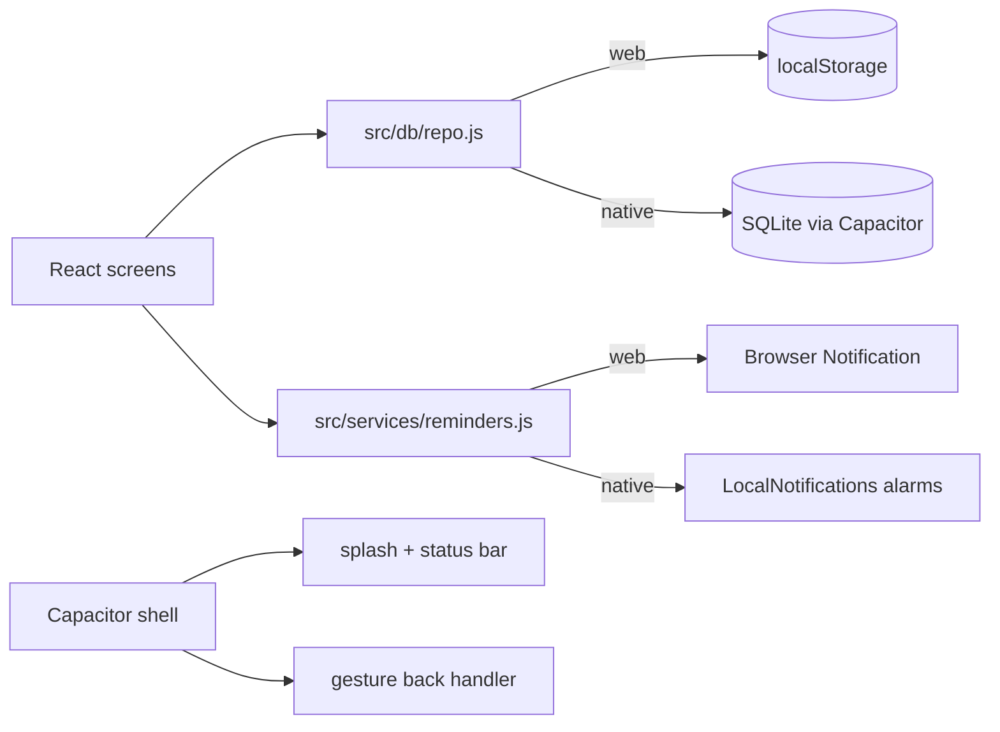

<div align="center">


# HabitTracker

Offline-first habit tracking — one React codebase shipping as an installable web app and a native Android app.

[](https://github.com/prathameshlonare/habit-tracker/actions)
[](https://github.com/prathameshlonare/habit-tracker/releases)
[](https://github.com/prathameshlonare/habit-tracker/commits)

</div>

## Table of Contents

- [What is this?](#what-is-this)
- [Features](#features)
- [Quick Start](#quick-start)
- [Architecture](#architecture)
- [Project Structure](#project-structure)
- [Android Release](#android-release)
- [Data Model](#data-model)
- [License](#license)

## What is this?

HabitTracker tracks daily habits, streaks, mood journaling, and progress analytics. It runs fully offline with no accounts: localStorage on web, SQLite on Android. The same Vite + React 19 build serves as a PWA and, via Capacitor 8, as the `com.habittracker.app` native package with background reminders, splash screen, and edge-to-edge Material 3 UI.

Built as a personal daily driver, shaped by real on-device testing.

## Features

- **Daily habits** — Today view, 7-day strip, per-habit streaks, bottom-sheet add/edit
- **Journal** — daily mood + guided prompts (gratitude, highlights, challenges, learning, goals)
- **Analytics** — completion trends, top performers, streak records
- **Reminders** — 9 AM / 6 PM daily alarms and streak milestones; system notifications on Android, browser notifications on web
- **PDF reports** — one-tap export, shared via the native share sheet on Android
- **Native shell** — adaptive icon, indigo splash with manual hide, gesture-back handling, haptic ticks

## Quick Start

Requires Node 22+ and Java 21 (Android only).

```bash
git clone https://github.com/prathameshlonare/habit-tracker.git
cd habit-tracker
npm ci
```

Run on web:

```bash
npm run dev            # localhost
npm run dev -- --host  # phone on the same Wi-Fi via LAN IP
```

Run on Android over USB (USB debugging on):

```bash
npm run build
npx cap sync android
cd android && ./gradlew :app:assembleDebug
adb install -r app/build/outputs/apk/debug/app-debug.apk
```

Ship a signed release by pushing a tag — CI builds, signs, and attaches the APK + AAB to the GitHub Release:

```bash
git tag v1.0.0 && git push origin v1.0.0
```

## Architecture



Screens never touch storage directly — everything goes through `repo.js`, which keeps a sync in-memory API and flushes to SQLite on native. First native launch seeds SQLite from any existing local data.

## Project Structure

```
habit-tracker/
├── .github/
│   └── workflows/
│       └── android-release.yml
├── public/
│   ├── icons/
│   ├── manifest.webmanifest
│   ├── logo.svg
│   └── sw.js
├── resources/
│   └── android-res/
├── scripts/
│   └── apply-android-custom.mjs
├── src/
│   ├── assets/
│   │   └── fonts/
│   ├── components/
│   │   ├── JournalCalendar.jsx
│   │   ├── MobileBottomNav.jsx
│   │   └── MobileDailyView.jsx
│   ├── db/
│   │   ├── adapters/
│   │   ├── repo.js
│   │   └── schema.js
│   ├── hooks/
│   ├── services/
│   │   ├── backHandler.js
│   │   ├── dbService.js
│   │   ├── exportPDF.js
│   │   └── reminders.js
│   ├── styles/
│   ├── App.jsx
│   └── main.jsx
├── capacitor.config.json
├── index.html
├── package.json
└── vite.config.js
```

`android/` is gitignored and regenerated (`npx cap add android` + `node scripts/apply-android-custom.mjs`, which re-applies icons, splash art, and manifest permissions from `resources/android-res/`).

## Android Release

- **App ID:** `com.habittracker.app` (permanent)
- **Permissions:** `POST_NOTIFICATIONS`, `SCHEDULE_EXACT_ALARM` / `USE_EXACT_ALARM`, `RECEIVE_BOOT_COMPLETED`, `INTERNET`, `ACCESS_NETWORK_STATE`
- **Signing:** release keystore lives off-repo; CI reads it from four secrets (`ANDROID_KEYSTORE_BASE64`, `ANDROID_KEYSTORE_PASSWORD`, `ANDROID_KEY_ALIAS`, `ANDROID_KEY_PASSWORD`), `versionCode` from the run number, `versionName` from the tag
- **Distribution:** signed APK on GitHub Releases today; Play internal-testing track later (sideloaded APKs still show the one-time unknown-source prompt — only Play removes that)

## Data Model

SQLite schema v1 (`src/db/schema.js`): `habits` + `habit_logs` (per-day checks), `journal_entries` (one row per date), `settings` (key/value), `meta` (schema version). Web mirrors the same shape in localStorage keys.

## License

Personal project. All rights reserved.

---

<div align="center">

Try the PWA, or grab the APK from [Releases](https://github.com/prathameshlonare/habit-tracker/releases) — and star the repo if daily streaks are your thing.

</div>
