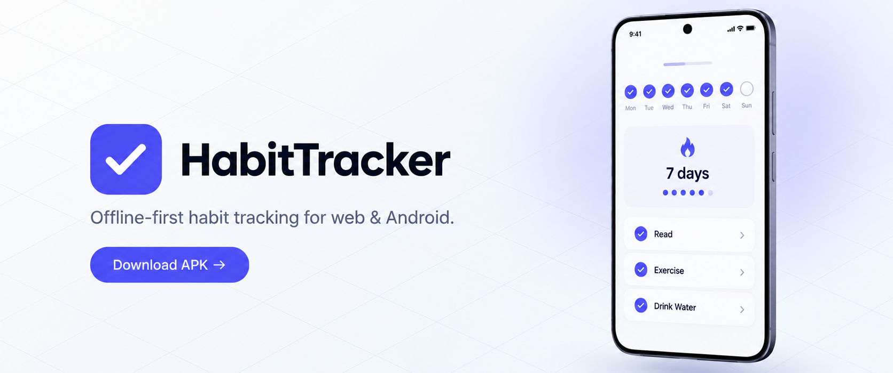
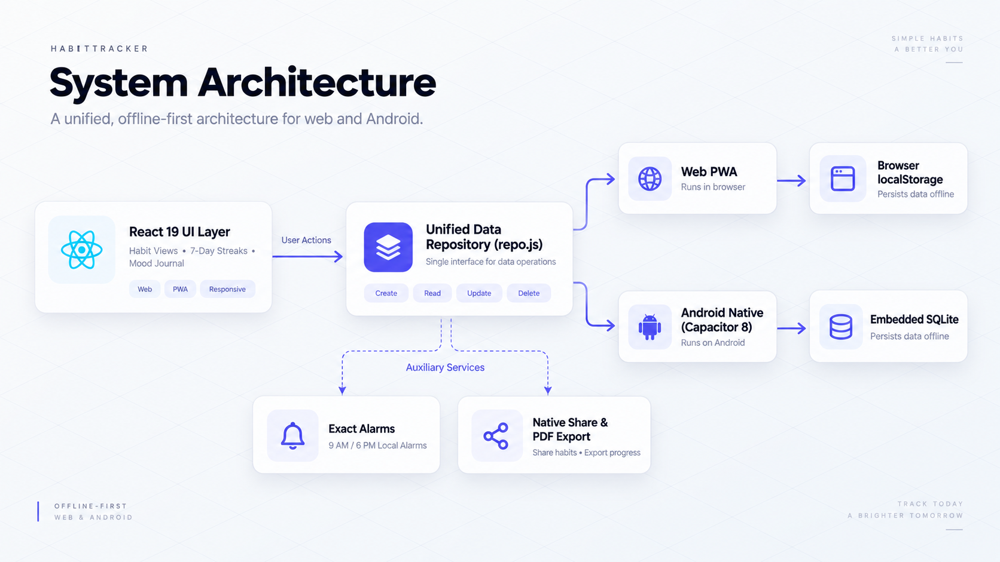
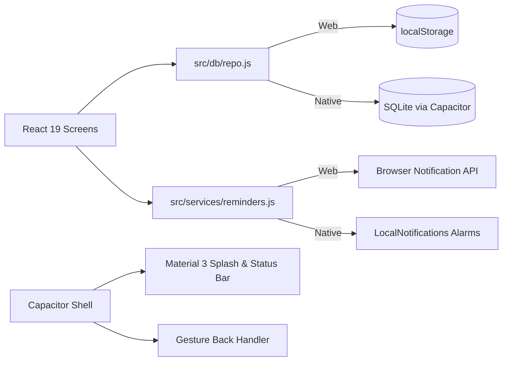

<div align="center">

<a href="https://github.com/prathameshlonare/habit-tracker/releases">
  
</a>

# HabitTracker

<p align="center">
  <b>One React 19 codebase shipping as an installable PWA and a native Android app with zero account lock-in.</b>
</p>

<a href="https://github.com/prathameshlonare/habit-tracker/actions"></a>
<a href="https://github.com/prathameshlonare/habit-tracker/releases"></a>
<a href="https://github.com/prathameshlonare/habit-tracker/commits"></a>


<p align="center">
  <a href="#quick-start">Quick Start</a> •
  <a href="#key-features">Features</a> •
  <a href="#architecture">Architecture</a> •
  <a href="https://github.com/prathameshlonare/habit-tracker/releases">Download APK</a>
</p>

</div>

<br />

## Overview

HabitTracker tracks daily habits, completion streaks, mood journaling, and analytics without third-party tracking servers or mandatory user accounts.

Data remains strictly on-device: stored in `localStorage` inside web browsers, and persisted directly to an embedded `SQLite` database on Android. The single Vite + React 19 codebase compiles to a Progressive Web App and packages into the native `com.habittracker.app` bundle via Capacitor 8 with system alarms, splash screen, and edge-to-edge Material 3 UI.

---

## Key Features

| Capability | Technical Implementation | Practical Benefit |
| :--- | :--- | :--- |
| **Offline-First Storage** | Unified `repo.js` routing to `localStorage` (Web) or `SQLite` (Android) | Zero accounts required. Instant startup with zero server roundtrips. |
| **Habit & Streak Tracking** | 7-day completion strip, per-habit streaks, and bottom-sheet editor | Visual accountability with automated streak calculation. |
| **Guided Mood Journal** | Structured prompts (gratitude, highlights, challenges, daily targets) | Daily reflection logging stored locally alongside habit logs. |
| **Automated Alarms** | Exact alarms via `LocalNotifications` (Android) and Web Notifications API | Scheduled 9:00 AM and 6:00 PM check-in prompts without cloud services. |
| **Analytics & PDF Export** | Client-side aggregation with native Android share sheet integration | One-tap printable performance reports via jsPDF. |
| **Native Android Shell** | Capacitor 8 with gesture back-handling, haptic feedback, and adaptive icons | Native look and feel from a single frontend codebase. |

---

## Quick Start

### Prerequisites
* **Node.js**: v22+
* **Java**: JDK 21 (Required for Android builds)

### 1. Web Development

```bash
git clone https://github.com/prathameshlonare/habit-tracker.git
cd habit-tracker
npm ci
npm run dev
```

> **Testing on Mobile (Same Wi-Fi)**: Run `npm run dev:lan` to access the development server from your phone's browser.

### 2. Android Build & USB Install

Connect an Android device with USB Debugging enabled:

```bash
npm run build
npx cap sync android
cd android && ./gradlew :app:assembleDebug
adb install -r app/build/outputs/apk/debug/app-debug.apk
```

---

## Architecture

Data flow is completely decoupled from UI components. Screens interact solely through `src/db/repo.js`:

<p align="center">
  
</p>

<details>
<summary><b>View Raw Mermaid Flowchart</b></summary>



</details>

---

## Deep Dive & Configuration

<details>
<summary><b>🚀 Android Release Pipeline & Keystore</b></summary>

Signed production APKs and AABs are generated automatically by GitHub Actions upon pushing a release tag:

```bash
git tag v1.0.1
git push origin v1.0.1
```

* **Package ID**: `com.habittracker.app`
* **Permissions**: `POST_NOTIFICATIONS`, `SCHEDULE_EXACT_ALARM`, `RECEIVE_BOOT_COMPLETED`, `INTERNET`
* **CI Secrets**: Keystore signing runs off-repo using `ANDROID_KEYSTORE_BASE64`, `ANDROID_KEYSTORE_PASSWORD`, `ANDROID_KEY_ALIAS`, and `ANDROID_KEY_PASSWORD`.

</details>

<details>
<summary><b>📂 Repository Structure</b></summary>

```text
habit-tracker/
├── .github/workflows/       # GitHub Actions Android release pipeline
├── public/                  # PWA manifest, service worker, and web icons
├── resources/android-res/   # Android overlay assets (splash, mipmap icons)
├── scripts/                 # Post-sync Capacitor asset overlay scripts
├── src/
│   ├── components/          # Calendar, Bottom Nav, Daily Habit views
│   ├── db/                  # SQLite schema & unified storage repository
│   └── services/            # Reminders, PDF export, back-handler
├── capacitor.config.json    # Native bridge configuration
└── vite.config.js
```

</details>

<details>
<summary><b>🗄️ Database Schema</b></summary>

SQLite Schema v1 (`src/db/schema.js`):
* `habits`: Definitions, color codes, targets.
* `habit_logs`: Timestamped completion checks.
* `journal_entries`: One entry per date (mood score + prompt answers).
* `settings`: Key/value configuration.

</details>

---

## License

Personal project. All rights reserved.
